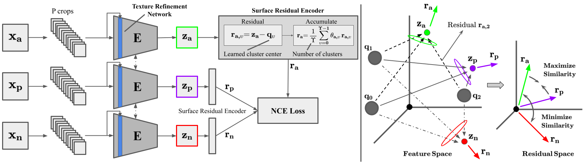
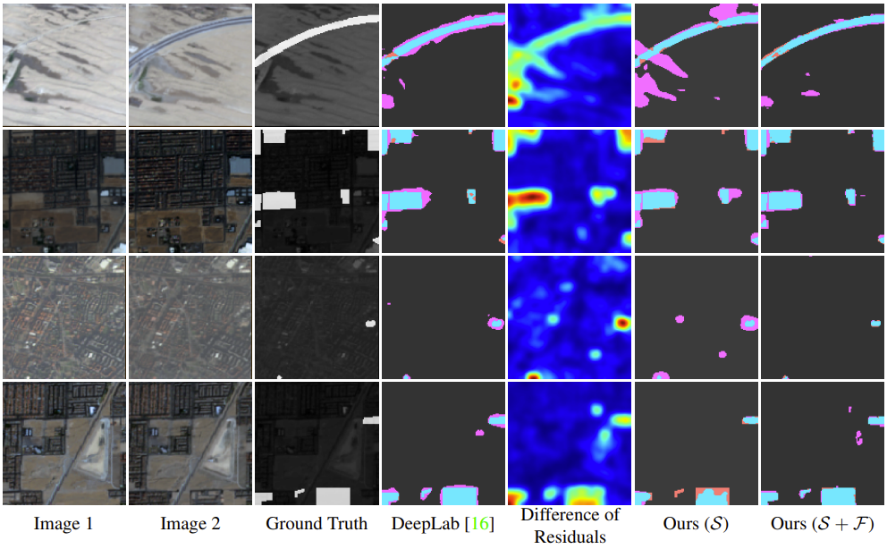

# MATTER: MATerial and TExture Representation Learning
This is an official implementation for ["Self-Supervised Material and Texture Representation Learning for Remote Sensing Tasks"](https://arxiv.org/pdf/2112.01715.pdf) (CVPR 2022, oral).

By [Peri Akiva](https://www.periakiva.com), [Matthew Purri](https://github.com/matthewpurri), and [Matt Leotta](https://www.kitware.com/matt-leotta/)

## Getting Started



Additional details will be added soon.
#### Environment Setup

#### Self-Supervised Training


## [Dataset](https://github.com/periakiva/MATTER/blob/main/docs/dataset_genetation.md)

##### Option 1: Download dataset from Google Drive:
[Download from here](https://drive.google.com/drive/folders/13cRnevIdM2ogBnvxg6VdkyL4GJ1yZkGm?usp=sharing)

##### Option 2: Use python script to download dataset: 

1. Setup path for `download_region.py` file.  
`export PEO_DOWNLOAD_DIR=/path/to/save/peo/data/`  
`export PEO_REGION_DOWNLOAD_SCRIPT_PATH=/<root>/tools/download_region.py`

2. Run download PEO bash script.  
`bash ./tools/download_dataset.sh`


## Main Results on Onera Change Detection



| **Method**            | **Sup.** | **Precision (%)** | **Recall (%)** | **F-1 (%)** |
|-----------------------|----------|-------------------|----------------|-------------|
| U-Net (random)        |     F    |       70.53       |      19.17     |    29.44    |
| U-Net (ImageNet)      |     F    |      70.42        |      25.12     |    36.20    |
| MoCo-v2               |   S + F  |       64.49       |      30.94     |    40.71    |
| SeCo                  |   S + F  |       65.47       |      38.06     |    46.94    |
| DeepLab-v3 (ImageNet) |     F    |       51.63       |      51.06     |    53.04    |
| Ours (fine-tuned)     |   S + F  |       61.80       |      57.13     |    59.37    |
| VCA                   |     S    |        9.92       |      20.77     |    13.43    |
| MoCo-v2               |     S    |       29.21       |      11.92     |    16.93    |
| SeCo                  |     S    |       74.70       |      15.20     |    25.26    |
| Ours                  |     S    |       37.52       |      72.65     |    49.48    |


Precision, recall, and F-1 (%) accuracies (higher is better) of the ”change” class on Onera Satellite Change Detection (OSCD) dataset validation set. F, and S represent full and self-supervision respectively. S + F refer to self-supervised pretraining followed by fully supervised fine-tuning. Random and ImageNet denote the type of backbone weight initialization that method uses.

## Citing MATTER
```
@article{akiva2021self,
  title={Self-Supervised Material and Texture Representation Learning for Remote Sensing Tasks},
  author={Akiva, Peri and Purri, Matthew and Leotta, Matthew},
  journal={arXiv preprint arXiv:2112.01715},
  year={2021}
}
```